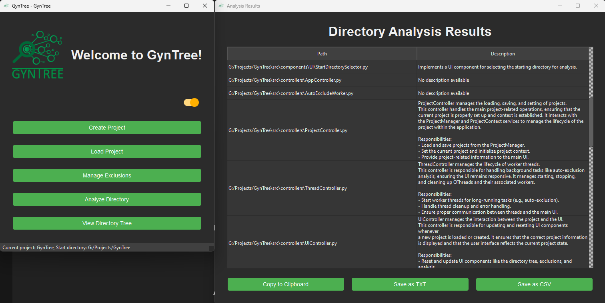
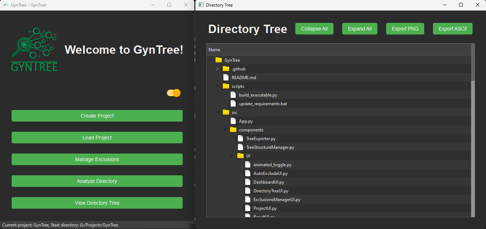

# GynTree: Comprehensive Directory Analysis Tool

GynTree is a powerful Python application designed to analyze and visualize complex directory structures, providing deep insights into your project's architecture. Whether you're managing a large codebase, organizing a media library, or just trying to understand the layout of a new project, GynTree has got you covered.

|  |  |  |
|:-------------------------------------------------:|:---------------------------------------------------------------:|:---------------------------------------------------------------:|
|                                       | GynTree Analysis View                                           | GynTree Directory View                                          |

## 🌟 Key Features

- **Smart Directory Analysis**: Quickly scan and map out your project structure, no matter how complex.
- **Intelligent Auto-Exclude**: Automatically identify and suggest exclusions for common file types and directories (e.g., `.git`, `__pycache__`, `node_modules`).
- **Interactive Tree Visualization**: Explore your project structure with an intuitive, collapsible tree view.
- **Multi-Format Exports**: Generate beautiful PNG images or ASCII text representations of your directory structure.
- **Customizable Exclusions**: Fine-tune your analysis by easily managing file and directory exclusions.
- **Comment Extraction**: Automatically extract and display file purpose comments, making it easier to understand your codebase at a glance.
- **Cross-Platform Compatibility**: Works seamlessly on Windows, macOS, and Linux.
- **Project Management**: Save and load multiple project configurations for quick access to different codebases.

## 🚀 Getting Started

Ready to dive in? You have two options:

1. **Download the Standalone Application**:  
   Get the latest version of GynTree as a standalone application directly from the [Latest Release](https://github.com/dsj7419/GynTree/releases/latest).

2. **Install from Source**:  
   Check out our [Installation Guide](./assets/docs/INSTALL.md) to get GynTree up and running from the source code on your system in no time!

## 📖 Documentation

- [User Guide](./assets/docs/user_guide.md): Learn how to use GynTree effectively.
- [Configuration](./assets/docs/configuration.md): Customize GynTree to suit your needs.
- [API Reference](./assets/docs/api_reference.md): For developers looking to extend GynTree's functionality.

## 🤝 Contributing

We welcome contributions from the community! Whether it's bug reports, feature requests, or code contributions, check out our [Contributing Guide](./assets/docs/CONTRIBUTING.md) to get started.

## 📜 License

GynTree is licensed under the Mozilla Public License, version 2.0. See the [LICENSE](LICENSE) file for details.

## 🙏 Acknowledgements

This is not my sole focus, and there's still a lot to do! I'll try to keep issues/project board populated, let me know if you'd like to take anything on! This project is started for personal use, but I hope others find it useful and can benefit from it. I would love additional help and insight to evolve this project even more.

---

Built with ❤️
